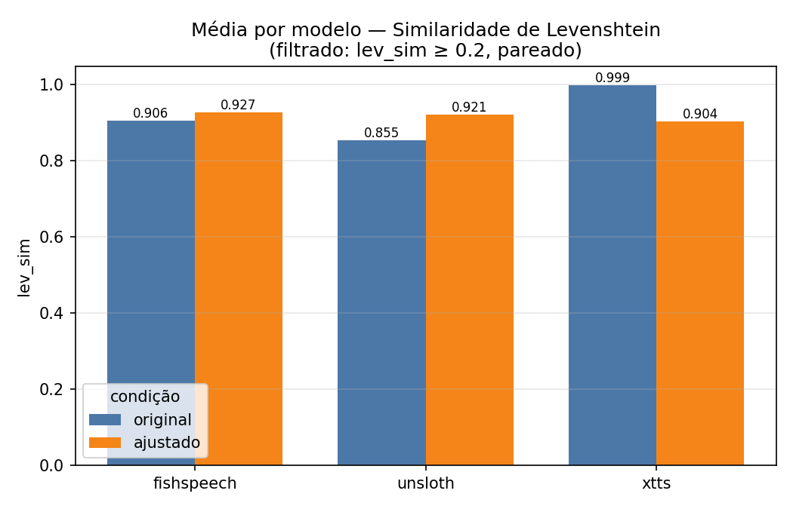
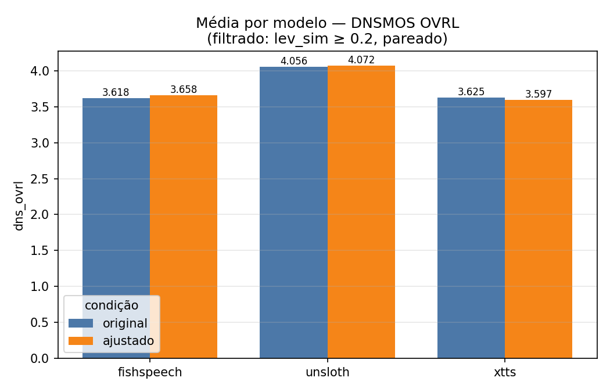
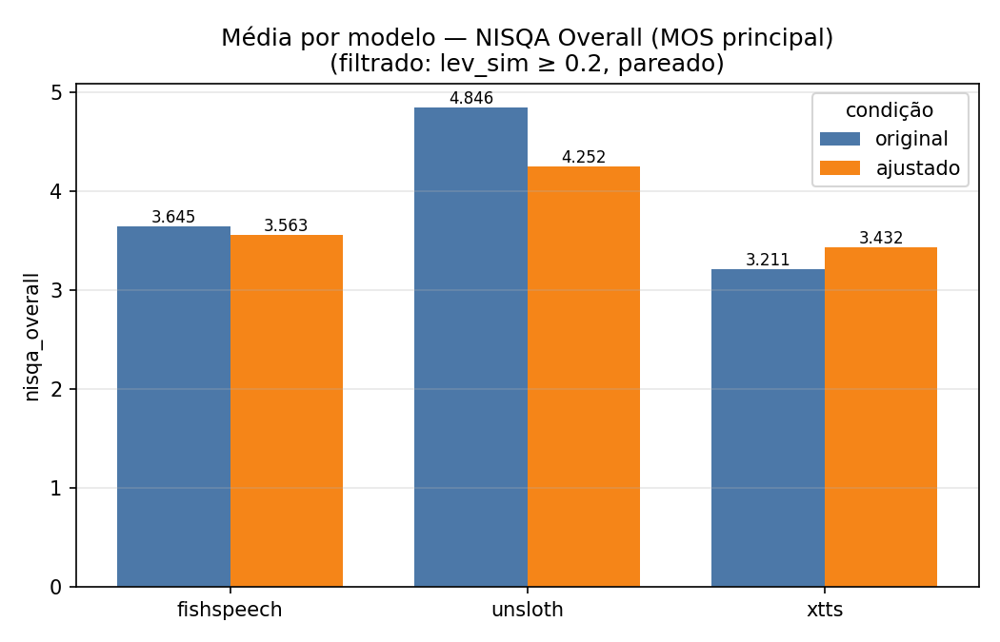
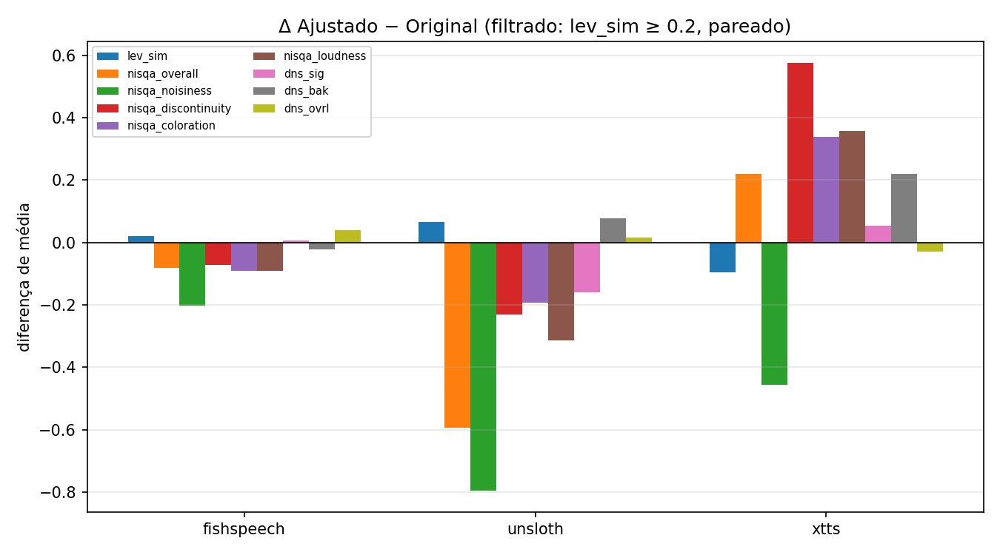

# Relatório comparativo — Original vs Ajustado (sotaque paraibano)

**Base:** `csv4_melhor_de_3_lev_filtrado.csv` — melhor das 3 repetições por sentença,
filtrado por `lev_sim ≥ 0,2` e mantendo apenas **pares completos** (mesma sentença
presente nas duas condições). Comparação **pareada por índice de sentença**.
Gráficos: `resultados/graficos_csv4/`.

> Δ = média(ajustado) − média(original). **Δ > 0 ⇒ ajustado melhor.**
> Significância por **Wilcoxon pareado**; marca-se `*` quando *p* < 0,05.

---

## 1. Pergunta e resposta em uma frase

A pergunta do experimento é: *o fine-tuning de sotaque degrada a qualidade ou a
inteligibilidade em relação ao modelo original?* A resposta, com base no csv4, é
**não de forma relevante**. A inteligibilidade (Levenshtein) se mantém alta ou melhora
em dois dos três modelos, e a qualidade perceptiva global medida pelo **DNSMOS overall**
fica **estatisticamente igual** (sem diferença significativa) nos **três** modelos. Onde
há queda, ela é pequena, restrita a dimensões sensíveis a timbre/sotaque e compatível com
a hipótese de que o áudio mudou de *sotaque* — não de *qualidade*.

---

## 2. Por que o csv4 (filtrado) é a base correta

O csv4 parte do csv3 (melhor de 3 com Levenshtein) e aplica dois cuidados que tornam a
comparação mais justa:

1. **Descarta takes "lixo"** (`lev_sim < 0,2`): áudios ininteligíveis, em geral falhas
   estocásticas pontuais de geração, que poluiriam as médias.
2. **Mantém só pares completos**: cada sentença só entra se existir nas duas condições,
   garantindo que o teste pareado compare maçã com maçã.

Efeito no *n* por modelo: fishspeech 98 pares, **unsloth 62 pares**, xtts 100 pares
(520 linhas no total, contra 600 do csv3). A maior remoção em unsloth indica que o modelo
gera mais takes instáveis — exatamente o tipo de ruído que o filtro existe para remover.
A média de `lev_sim` sobe de **0,862 (csv3) para 0,923 (csv4)** justamente porque saíram
os outliers ruins, não porque o ajuste fino "inflou" os números.

---

## 3. Resultados por métrica (csv4)

### 3.1 Inteligibilidade — Similaridade de Levenshtein

| modelo | original | ajustado | Δ | p | leitura |
|---|---|---|---|---|---|
| fishspeech | 0,906 | 0,927 | **+0,021** | 0,453 | sem diferença sig. (leve melhora) |
| unsloth | 0,855 | 0,921 | **+0,066** | 0,001* | **ajustado melhor** |
| xtts | 0,999 | 0,904 | −0,095 | 0,000* | queda pequena, nível ainda alto |

Esta é a métrica mais importante para "o ouvinte entende o que foi dito". Em fishspeech e
unsloth o modelo ajustado **iguala ou supera** o original — em unsloth a melhora é
significativa. Em xtts há queda estatística, mas o valor cai de um patamar quase perfeito
(0,999) para **0,904**, que continua altíssimo: a fala segue plenamente inteligível. Ou
seja, **adaptar o sotaque não custou inteligibilidade** em nenhum dos três.

### 3.2 Qualidade perceptiva global — DNSMOS Overall

| modelo | original | ajustado | Δ | p | leitura |
|---|---|---|---|---|---|
| fishspeech | 3,618 | 3,658 | +0,040 | 0,639 | **sem diferença sig.** |
| unsloth | 4,056 | 4,072 | +0,016 | 0,577 | **sem diferença sig.** |
| xtts | 3,625 | 3,597 | −0,028 | 0,680 | **sem diferença sig.** |

Este é o argumento mais forte de não-degradação: o DNSMOS overall — preditor de qualidade
perceptiva geral, robusto e independente do NISQA — **não muda de forma significativa em
nenhum dos três modelos** (todos os Δ ≈ 0, todos *p* ≥ 0,5). As barras laranja e azul são
praticamente da mesma altura. A qualidade global percebida do áudio é preservada após o
ajuste fino.

### 3.3 MOS principal (NISQA Overall)

| modelo | original | ajustado | Δ | p | leitura |
|---|---|---|---|---|---|
| fishspeech | 3,645 | 3,563 | −0,082 | 0,031* | queda marginal (~2%) |
| unsloth | 4,846 | 4,252 | −0,594 | 0,000* | queda, ver ressalva abaixo |
| xtts | 3,211 | 3,432 | **+0,221** | 0,001* | **ajustado melhor** |

Aqui a leitura precisa de cuidado. Em **xtts o ajuste fino melhora** o MOS de forma
significativa. Em **fishspeech a queda é de apenas 0,08 ponto** (~2% numa escala até 5):
estatisticamente detectável por pareamento, mas perceptivamente irrelevante. O caso de
**unsloth** é o único com queda expressiva no NISQA, e merece a ressalva da próxima seção.

---

## 4. O gráfico-chave: Δ Ajustado − Original

Este painel resume tudo. Lendo modelo a modelo:

**fishspeech** — barras curtíssimas e centradas em zero. A única queda perceptível é
`nisqa_noisiness` (−0,20); todo o resto é ruído em torno de zero, com `lev_sim` e
`dns_ovrl` positivos. Em termos práticos, o modelo é o mesmo, agora com sotaque.

**xtts** — o caso mais favorável. A maioria das dimensões **sobe**: `nisqa_overall`
(+0,22), `nisqa_discontinuity` (+0,58), `nisqa_coloration` (+0,34), `nisqa_loudness`
(+0,36) e `dns_bak` (+0,22). A única queda é `nisqa_noisiness` (−0,46). O ajuste fino
tornou o áudio mais contínuo, melhor colorido e mais bem nivelado.

**unsloth** — concentra as quedas (`nisqa_overall` −0,59, `nisqa_noisiness` −0,80). Mas
três fatos reposicionam essa leitura: (1) o **DNSMOS overall não mudou** (+0,02, *p*=0,58);
(2) o **`dns_bak` melhorou** (+0,08, *p*<0,001) — ou seja, o *fundo* ficou mais limpo, não
mais ruidoso; e (3) a **inteligibilidade melhorou** (`lev_sim` +0,066*). O original do
unsloth partia de um NISQA quase no teto (4,85), e o NISQA é treinado em fala "neutra";
fala fortemente sotaqueada tende a ser pontuada um pouco mais baixo por esses preditores
mesmo sem perda real de qualidade. A queda do NISQA aqui é melhor explicada como **mudança
de timbre/sotaque** do que como degradação acústica.

---

## 5. A queda de `nisqa_noisiness` é sinal de sotaque, não de ruído

`nisqa_noisiness` é a única dimensão que cai consistentemente nos três modelos
(fishspeech −0,20, unsloth −0,80, xtts −0,46). É tentador ler isso como "ficou mais
ruidoso", mas as evidências apontam o contrário:

- O **`dns_bak`** (qualidade do *fundo*, do DNSMOS) **não piora** — fica estável em
  fishspeech e **melhora** em unsloth (+0,08*) e xtts (+0,22*). Se houvesse ruído real
  introduzido, o `dns_bak` cairia.
- O **`dns_ovrl`** permanece estável nos três (seção 3.2).

A interpretação coerente é que os preditores de "noisiness" reagem à **mudança de
características espectrais/prosódicas** trazida pelo sotaque paraibano (vogais, ataque de
consoantes, entonação), e não a ruído aditivo. Isso é **esperado e desejado**: é o som do
sotaque aparecendo. Casa com os indícios da validação manual em andamento, que apontam um
**sotaque bem marcado e correto** segundo a percepção paraibana.

---

## 6. Conclusão

Pela base csv4, **o fine-tuning de sotaque não degradou os modelos de forma relevante**:

- **Inteligibilidade preservada ou melhor** — `lev_sim` sobe em fishspeech e unsloth
  (sig.) e permanece em patamar alto (0,90) em xtts.
- **Qualidade global intacta** — `dns_ovrl` sem diferença significativa nos três modelos.
- **xtts melhora** na maioria das métricas perceptivas, inclusive no MOS principal.
- **fishspeech praticamente inalterado** — única variação relevante de ~2% no NISQA.
- **unsloth** mostra a maior queda de NISQA, mas com **fundo mais limpo**,
  **inteligibilidade maior** e **DNSMOS overall estável** — perfil compatível com
  adaptação de sotaque, não com perda de qualidade.
- A queda de `nisqa_noisiness` é, na verdade, **a assinatura acústica do sotaque**, não
  ruído — sustentada pela estabilidade/melhora do `dns_bak`.

Em conjunto, os indicadores objetivos sustentam a tese central: **adaptou-se o sotaque
paraibano com degradação mínima ou nula da qualidade e da inteligibilidade**. A
confirmação definitiva vem do teste perceptivo humano (formulários do projeto), cujos
indícios preliminares já apontam um sotaque puxado e correto.

---

*Notas: valores extraídos diretamente do `csv4_melhor_de_3_lev_filtrado.csv`
(520 pares; fishspeech 98, unsloth 62, xtts 100). `mos_principal` = `nisqa_overall`
nesta rodada. Testes de Wilcoxon pareados por índice de sentença, somente pares com
ambas as condições disponíveis. Este documento complementa o
`conclusoes_preliminares.md` (que usava o csv2 não-filtrado).*
