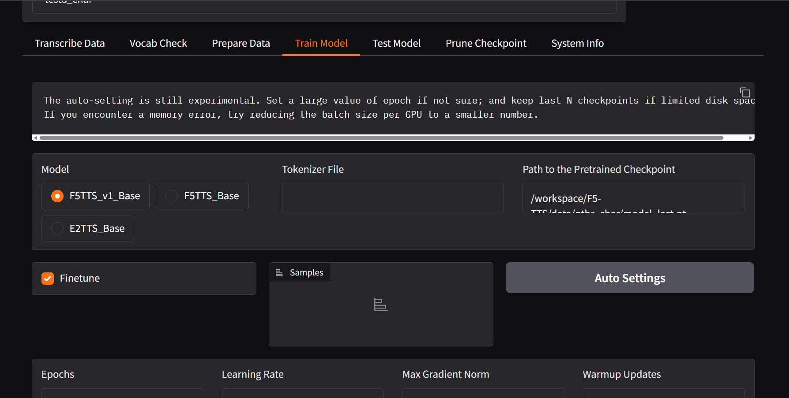
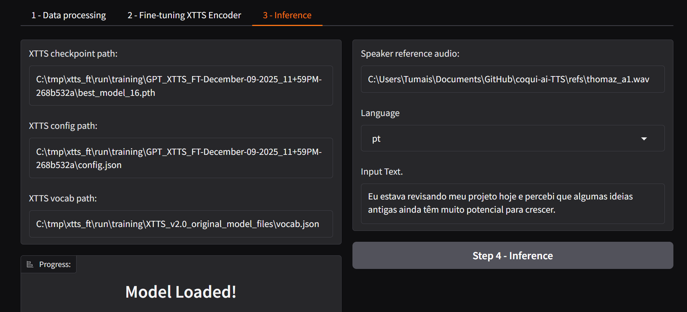

<style>
  .wrapper,
  .markdown-body, .inner, #main_content {
    max-width: 90% !important;
    padding: 1rem 2rem !important;
  }
  .markdown-body table {
    width: 100%;
    border-collapse: collapse;
    margin-bottom: 1rem;
  }
  .markdown-body th,
  .markdown-body td {
    border: 1px solid #ccc;
    padding: 0.5rem;
  }
  .markdown-body th {
    background: #f5f5f5;
    text-align: left;
  }
  .experiment-image, 
  .markdown-body img {
    display: block;
    margin: 1.5rem auto;
    max-width: 90%;
    border: 1px solid #ddd;
    border-radius: 6px;
  }
</style>

# Continuação do Finetuning

Nesta parte foram feitos testes iniciais com 5 áudios de finetuning nos modelos XTTS e F5 TTS.

## F5 TTS

O F5 TTS apresentou muitos problemas para rodar, mas consegui depois de muita dificuldade fazer o docker funcionar corretamente. Apesar de rodar, o modelo carregado só gera gibberish (texto sem sentido).


*Figura 1: Interface da aplicação durante o finetune.*


### Exemplo de Áudio Gerado (Gibberish)

*Áudio gerado pelo modelo F5 TTS após finetuning - apresenta apenas gibberish:*

<audio controls src="../audios/experimento_finetune2/placeholder_f5.wav"></audio>

## XTTS

O XTTS foi mais bem-sucedido. Consegui fazer o treino por uma época com 5 áudios.

### Áudios Gerados

*Áudios gerados após uma época de treinamento com áudios:*

<audio controls src="../audios/experimento_finetune2/1.wav"></audio>
<audio controls src="../audios/experimento_finetune2/2.wav"></audio>
<audio controls src="../audios/experimento_finetune2/3.wav"></audio>

## Imagens das Aplicações com Finetune

Aqui estão as imagens das aplicações com finetune rodando:


*Figura 1: Interface da aplicação durante o finetune.*


## Código para Rodar o Finetune

### F5 TTS

**Finetune:**

```bash
docker container run --rm -it --gpus=all -v C:\Users\Tumais\Documents\GitHub\F5-TTS\data:/workspace/F5-TTS/data -v C:\Users\Tumais\Documents\GitHub\F5-TTS\ckpts:/workspace/F5-TTS/ckpts -p 7860:7860 ghcr.io/swivid/f5-tts:main f5-tts_finetune-gradio --host 0.0.0.0
```

**Finetune com cache:**

```bash
docker container run --rm -it --gpus=all -v C:\Users\Tumais\Documents\GitHub\F5-TTS\data:/workspace/F5-TTS/data -v C:\Users\Tumais\Documents\GitHub\F5-TTS\ckpts:/workspace/F5-TTS/ckpts -v C:\Users\Tumais\.cache\huggingface:/root/.cache/huggingface -p 7860:7860 ghcr.io/swivid/f5-tts:main f5-tts_finetune-gradio --host 0.0.0.0
```

**Interface:** http://localhost:7860

**Caminhos dos modelos:**
- `/workspace/F5-TTS/data/ptbr_char/model_last.safetensors`
- `/workspace/F5-TTS/data/ptbr_char/model_last.pt`

**Inferência:**


### XTTS

**Comando para rodar o demo:**

```bash
python TTS/demos/xtts_ft_demo/xtts_demo.py
```

```
C:\tmp\xtts_ft\run\training\GPT_XTTS_FT-December-09-2025_11+59PM-268b532a\best_model_16.pth
C:\tmp\xtts_ft\run\training\GPT_XTTS_FT-December-09-2025_11+59PM-268b532a\config.json
C:\tmp\xtts_ft\run\training\XTTS_v2.0_original_model_files\vocab.json
C:\Users\Tumais\Documents\GitHub\coqui-ai-TTS\refs\thomaz_a1.wav
```

