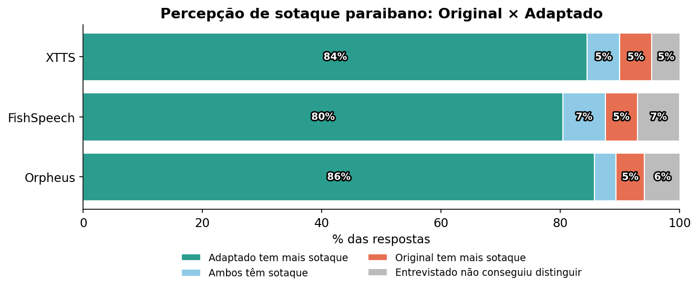
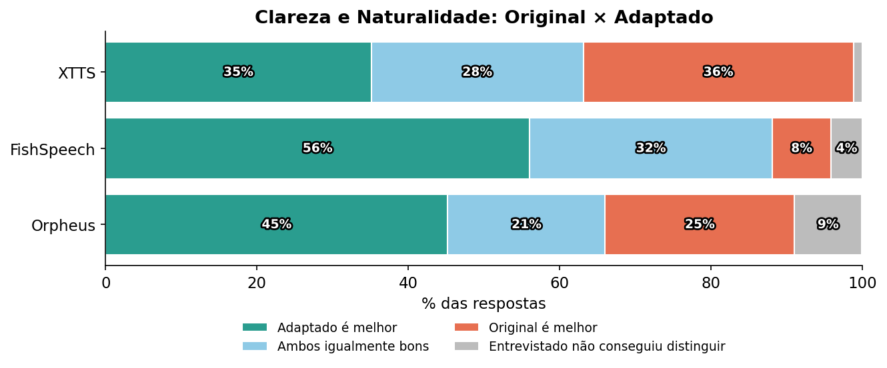
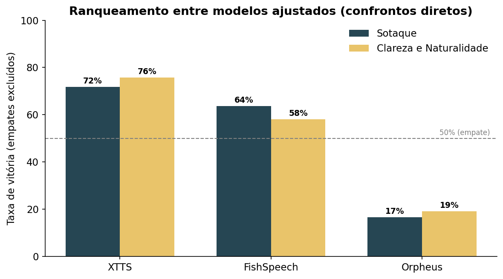
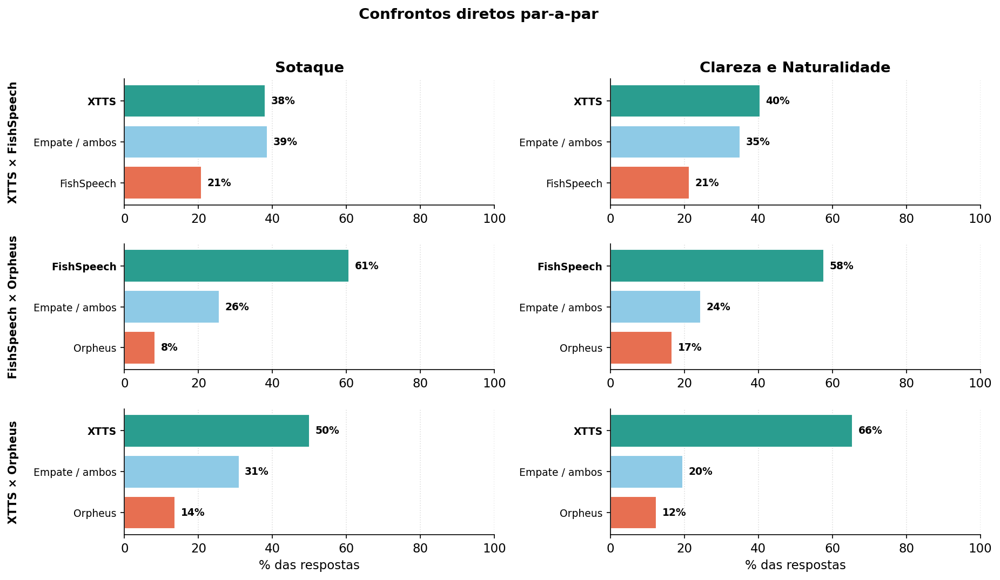

# Avaliação perceptual de sotaque paraibano e inteligibilidade em falas sintetizadas

**Análise da avaliação manual (formulário 1)** · Base: 56 respondentes · Data: 2026-06-19

Este relatório analisa as respostas do formulário *"Avaliação de Sotaque Paraibano em Falas Sintetizadas"*. Cada respondente avaliou pares de áudios em dois critérios: **(i)** qual representa melhor o sotaque paraibano (*sotaque*) e **(ii)** qual é melhor em naturalidade e clareza (*inteligibilidade*). A ordem dos áudios em cada par foi aleatorizada, de modo que "Áudio A" e "Áudio B" não correspondem a um modelo fixo entre as questões.

O instrumento se divide em dois blocos:

- **Bloco 1 — Original × Adaptado:** três modelos base (XTTS, FishSpeech e Unsloth/Orpheus) confrontados, cada um, com sua versão ajustada (fine-tuning para fala paraibana). Três amostras de áudio por modelo.
- **Bloco 2 — Ranqueamento entre os modelos ajustados:** confrontos diretos par-a-par entre XTTS, FishSpeech e Unsloth, para eleger o melhor modelo treinado.

As opções *"Ambos aparentam ter sotaque paraibano"* (no critério sotaque) e *"Ambos soam igualmente bem"* (no critério inteligibilidade) são tratadas como **resultados favoráveis** ao ajuste, pois o objetivo do trabalho é verificar se o modelo ajustado **passa a compartilhar** a característica desejada com — ou a superar — o modelo base, e não necessariamente superá-lo de forma isolada.

## Composição da amostra

| Familiaridade com o sotaque paraibano | n | % |
|---|---|---|
| Sou da Paraíba | 14 | 25,0% |
| Familiarizado com o sotaque paraibano | 13 | 23,2% |
| Familiarizado com sotaques nordestinos | 20 | 35,7% |
| Pouca ou nenhuma familiaridade | 9 | 16,1% |
| **Total** | **56** | **100%** |

Os resultados principais abaixo usam todos os 56 respondentes. Para robustez, cada pergunta também foi recalculada em dois subgrupos: apenas paraibanos (n=14) e o conjunto de respondentes com algum grau de familiaridade, excluindo quem declarou "pouca ou nenhuma" (n=47). As conclusões se mantêm em todos os recortes.

## Método

Para cada modelo do Bloco 1, agregamos as três amostras de áudio (3 × 56 = 168 respostas por critério). Classificamos cada resposta como favorável ao **adaptado**, favorável ao **original**, **empate** ("ambos...") ou **não-distinguível** ("não consigo distinguir"). Para testar significância estatística aplicamos o **teste binomial exato** comparando preferências pelo adaptado contra preferências pelo original (descartando empates e respostas não-distinguíveis), sob a hipótese nula de proporção 0,5. No Bloco 2, contabilizamos vitórias, derrotas e empates de cada modelo e derivamos uma **taxa de vitória** (vitórias / [vitórias + derrotas], empates excluídos).

---

## Pergunta 1 — A adaptação adiciona sotaque paraibano?

> **Pergunta original:** "É adicionado sotaque do modelo original para o ajustado?"
>
> **Reformulação científica:** *"O processo de fine-tuning incrementa, de forma estatisticamente significativa, a percepção de sotaque paraibano nas falas sintetizadas pelo modelo ajustado em relação ao modelo base correspondente?"*

A resposta é **sim, para os três modelos**, com efeito muito forte e altamente significativo. Considerando favorável a soma de "adaptado escolhido" + "ambos têm sotaque":

| Modelo | Adaptado tem mais sotaque | Ambos têm sotaque | Original tem mais | Não distingue | **Sotaque adicionado (favorável)** | Binomial (adaptado > original) |
|---|---|---|---|---|---|---|
| **XTTS** | 84,5% | 5,4% | 5,4% | 4,8% | **89,9%** | p ≈ 3,3 × 10⁻³² |
| **FishSpeech** | 80,4% | 7,1% | 5,4% | 7,1% | **87,5%** | p ≈ 2,7 × 10⁻³⁰ |
| **Unsloth/Orpheus** | 85,7% | 3,6% | 4,8% | 6,0% | **89,3%** | p ≈ 1,1 × 10⁻³³ |

Em todos os casos, cerca de 8 a 9 em cada 10 respostas indicam que o modelo ajustado carrega o sotaque paraibano, contra apenas ~5% que ainda apontam o original como mais sotaqueado. A diferença é massivamente significativa (p extremamente baixo em todos). Entre os respondentes paraibanos o efeito é ainda mais nítido — no FishSpeech, 95,2% apontaram o áudio ajustado e nenhum apontou o original.

**Conclusão Q1:** o fine-tuning **insere o sotaque paraibano** percebido em todos os três modelos. Esse era o objetivo central do ajuste e foi atingido de forma consistente e estatisticamente robusta.

---

## Pergunta 2 — O ajuste melhora ou piora os modelos?

> **Pergunta original:** "Nosso ajuste piora ou melhora os modelos originais comparando-os com os ajustados a partir dos respondentes?"
>
> **Reformulação científica:** *"A adaptação preserva ou aprimora a naturalidade e a inteligibilidade percebidas da fala sintetizada, em comparação ao modelo base, sem degradação significativa de qualidade?"*

Aqui o critério é a inteligibilidade (naturalidade + clareza). Tratamos como favorável "adaptado melhor" + "ambos igualmente bons" (ou seja, o ajuste **não degrada** a qualidade). O quadro varia por modelo:

| Modelo | Adaptado melhor | Ambos iguais | Original melhor | Não distingue | **Não piora (favorável)** | Binomial (adaptado > original) | Veredito |
|---|---|---|---|---|---|---|---|
| **XTTS** | 35,1% | 28,0% | 35,7% | 1,2% | **63,1%** | p ≈ 0,57 (n.s.) | Mantém a qualidade (neutro) |
| **FishSpeech** | 56,0% | 32,1% | 7,7% | 4,2% | **88,1%** | p ≈ 1,3 × 10⁻¹⁶ | **Melhora claramente** |
| **Unsloth/Orpheus** | 45,2% | 20,8% | 25,0% | 8,9% | **66,1%** | p ≈ 1,1 × 10⁻³ | Melhora moderadamente |

Leitura por modelo:

- **FishSpeech:** o ajuste **melhora** a inteligibilidade de forma significativa. O adaptado é preferido em 56% das respostas contra apenas 7,7% para o original, e somando empates 88% das respostas não indicam piora. Entre paraibanos chega a 90,5% favorável.
- **Unsloth/Orpheus:** melhora **moderada porém significativa** (p ≈ 0,001). O adaptado supera o original (45,2% × 25,0%); dois terços das respostas não indicam piora.
- **XTTS:** resultado **neutro/empate estatístico**. Adaptado (35,1%) e original (35,7%) ficam praticamente empatados (p ≈ 0,57, não significativo), com 28% considerando ambos igualmente bons. Ou seja, o ajuste **não piora** a inteligibilidade do XTTS — preserva a qualidade enquanto adiciona o sotaque (ver Q1) — mas também não a melhora de modo mensurável.

**Conclusão Q2:** o ajuste **não degrada** a inteligibilidade de nenhum modelo. Para FishSpeech e Unsloth ele de fato a **melhora** (significativamente); para o XTTS ela é **preservada**. Combinado com a Q1, o resultado é o cenário desejado: ganho de sotaque sem perda de qualidade percebida.

---

## Pergunta 3 — Qual modelo ajustado é o campeão?

> **Pergunta:** *"Qual dos modelos ajustados se desempenhou melhor nos quesitos sotaque e inteligibilidade, nos confrontos diretos?"*

No Bloco 2 os três modelos ajustados foram confrontados par-a-par. A taxa de vitória abaixo desconsidera empates ("ambos...") e respostas não-distinguíveis.

| Modelo | Taxa de vitória — Sotaque | Taxa de vitória — Inteligibilidade |
|---|---|---|
| 🥇 **XTTS** | **71,8%** (148 V / 58 D / 117 E) | **75,7%** (178 V / 57 D / 92 E) |
| 🥈 **FishSpeech** | 63,7% (137 V / 78 D / 108 E) | 58,1% (133 V / 96 D / 100 E) |
| 🥉 **Unsloth/Orpheus** | 16,6% (37 V / 186 D / 95 E) | 19,1% (49 V / 207 D / 74 E) |

Confrontos diretos (todos os respondentes):

- **XTTS × FishSpeech:** XTTS vence em sotaque (38,1% × 20,8%, com 38,7% de empate) e em inteligibilidade (40,5% × 21,4%). Confronto mais equilibrado, mas favorável ao XTTS.
- **FishSpeech × Unsloth:** FishSpeech domina em sotaque (60,7% × 8,3%) e inteligibilidade (57,7% × 16,7%).
- **XTTS × Unsloth:** XTTS domina em ambos (sotaque 50,0% × 13,7%; inteligibilidade 65,5% × 12,5%).

**Conclusão Q3:** o **XTTS ajustado é o campeão** tanto em sotaque quanto em inteligibilidade, seguido pelo **FishSpeech** em segundo e pelo **Unsloth/Orpheus** em último, com larga margem. O ranqueamento é idêntico nos dois critérios e se mantém entre os respondentes paraibanos, onde a vantagem do XTTS é ainda maior (taxa de vitória ~83% em sotaque, ~80% em inteligibilidade).

---

## Síntese

1. **Sotaque adicionado:** sim, nos três modelos (~88–90% favorável; p ≪ 0,001). O fine-tuning cumpre seu objetivo principal.
2. **Qualidade preservada/melhorada:** o ajuste não piora nenhum modelo. FishSpeech e Unsloth melhoram em inteligibilidade; XTTS mantém a qualidade. Não há *trade-off* perceptível entre adicionar sotaque e perder naturalidade.
3. **Melhor modelo:** **XTTS ajustado**, vencedor em sotaque e inteligibilidade, com FishSpeech em segundo e Unsloth/Orpheus em terceiro.

### Observações metodológicas

A amostra (n=56) é modesta, mas os tamanhos de efeito na Q1 e no ranqueamento são grandes o suficiente para conclusões robustas mesmo sob correção para múltiplas comparações. Na Q2 do XTTS o resultado é genuinamente neutro, e não falta de potência: as proporções adaptado/original são quase idênticas. Recomenda-se, em trabalhos futuros, registrar tempos de resposta e usar uma escala MOS contínua além da preferência forçada, e equilibrar o número de respondentes "pouca/nenhuma familiaridade" para análises de subgrupo mais conclusivas.

*Dados e cálculos reproduzíveis em `analise_sotaque.py`; gráficos em `graficos.py` (pasta `figs/`); saída completa em `resultados.json`.*
