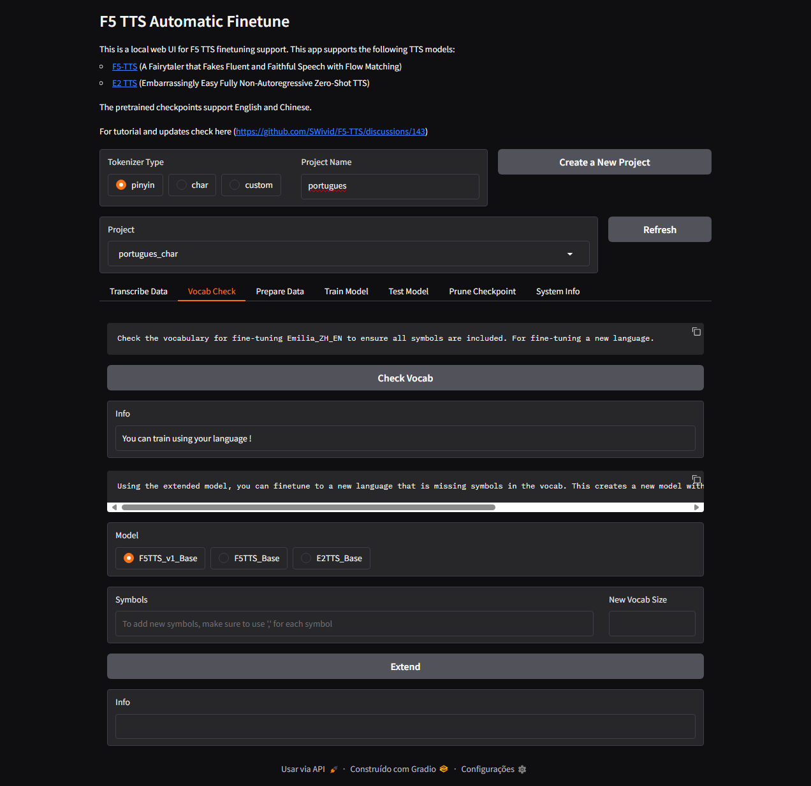
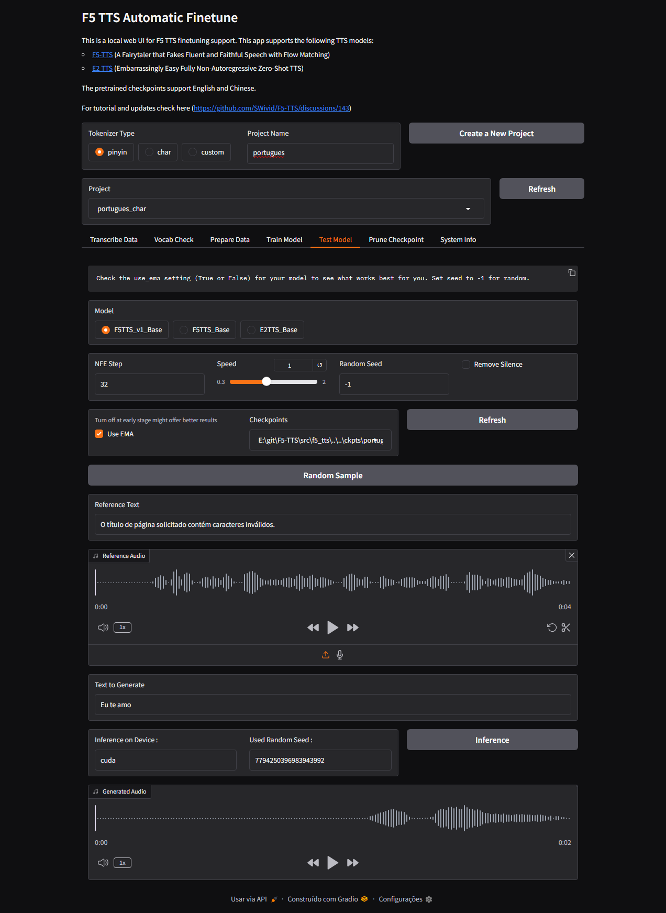

<style>
  .wrapper,
  .markdown-body, .inner, #main_content {
    max-width: 90% !important;
    padding: 1rem 2rem !important;
  }
  .markdown-body table {
    width: 100%;
    border-collapse: collapse;
    margin-bottom: 1rem;
  }
  .markdown-body th,
  .markdown-body td {
    border: 1px solid #ccc;
    padding: 0.5rem;
  }
  .markdown-body th {
    background: #f5f5f5;
    text-align: left;
  }
  .experiment-image {
    display: block;
    margin: 1rem auto;
    max-width: 100%;
    border: 1px solid #ddd;
    border-radius: 4px;
  }
</style>

# Relatório de Fine-tuning do F5-TTS

Bem-vindo ao relatório do meu experimento de *fine-tuning* usando o **F5-TTS** com o corpus em português. Repositório: https://github.com/SWivid/F5-TTS

---

## 🧪 Configuração do Ambiente

- **GPU**: NVIDIA RTX 4060 Ti  
- **Driver**: Game Ready mais recente  
- **PyTorch**: 2.4.0 + CUDA 12.4  
- **Dataset**: [TTS-Portuguese-Corpus](https://github.com/Edresson/TTS-Portuguese-Corpus)  
- **Checkpoint Base**: `pt-br/model_last.safetensors`

---

## 📊 Metodologia

1. Conversão dos áudios para 24kHz  
2. Geração do `raw.arrow`, `duration.json` e `vocab.txt`  
3. Execução do `finetune_cli.py` com:
   - Epochs: 1 (teste inicial)  
   - Batch size: 1  
   - Mixed Precision: fp16  

---

## 📈 Resultados Parciais

Durante o treinamento foram gerados checkpoints salvos em `ckpts/ptbr_char_test/`.

Aqui estão alguns exemplos de saída:

### Áudio gerado (linkado do repositório ou externo)

- 🎧 [Sample 1](audios/update_1000_gen.wav)  

### Comparação entre referência e gerado

| Referência | Gerado |
|------------|--------|
|  |  |

---

## 🖼️ Prints da aplicação

Aqui alguns prints do processo de treino:

  
*Figura 1: Interface do Gradio usada no treino.*

  
*Figura 2: Interface do Gradio usada no treino.*

  
*Figura 3: Interface do Gradio usada no treino.*

  
*Figura 4: Interface do Gradio usada no treino.*

  
*Figura 5: Interface do Gradio usada no treino.*

  
*Figura 6: Interface do Gradio usada no treino.*

  
*Figura 7: Interface do Gradio usada no treino.*

---

## 🚀 Próximos Passos

- Aumentar número de épocas (>=50)  
- Avaliar métricas de qualidade perceptiva (MOS)  
- Testar vocoder alternativo (BigVGAN)  


## Código para rodar
``` 
conda create -n f5-tts python=3.10 -y
conda activate f5-tts

pip install --upgrade pip
pip install torch==2.4.0+cu124 torchaudio==2.4.0+cu124 --extra-index-url https://download.pytorch.org/whl/cu124

pip install -e .
pip install accelerate peft datasets gradio librosa soundfile


pip install pandas datasets soundfile librosa pyarrow

f5-tts_finetune-gradio


vocab: data/ptbr_char/vocab.txt
checkpoint: ckpts/ptbr_firstpixel/model_last.safetensors

```