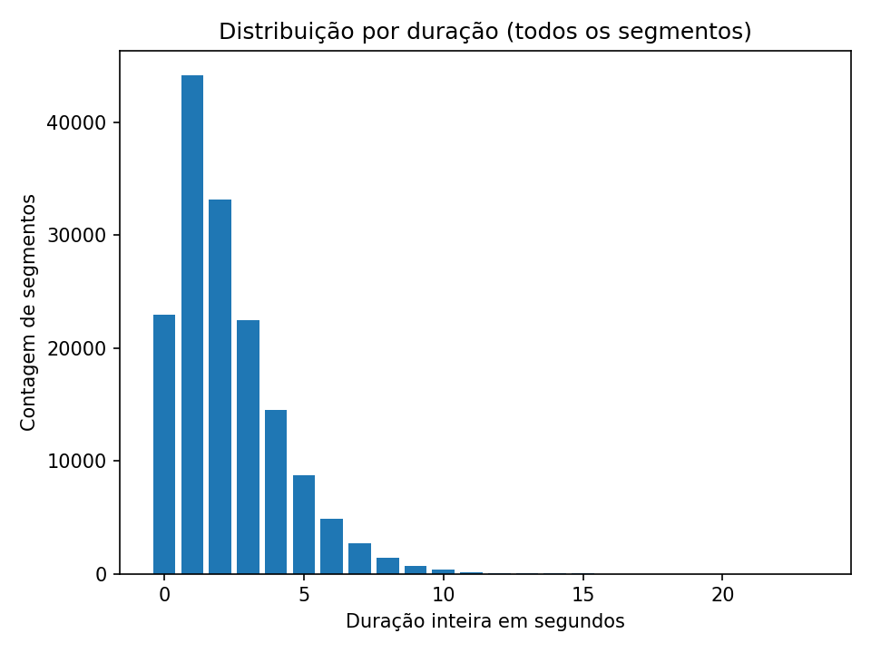
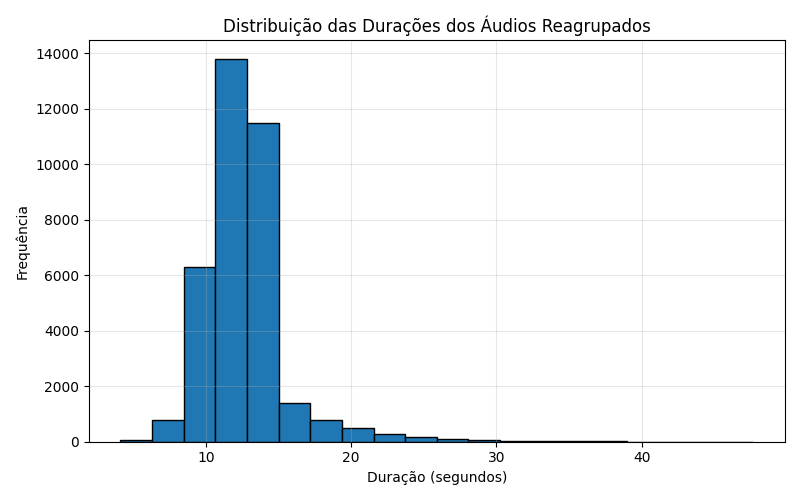

### Continuação da coleta das bases (Braccent, Sotaque Brasileiro e CoLingPB)

Após o contato com os autores das três bases, obtive as seguintes respostas:

- **Braccent** — autorização concedida por *Nathalia*  
- **Sotaque Brasileiro** — autorização concedida por *Gabriel*  
- **CoLingPB** — o professor responsável encontra-se em período de férias  

Como as duas primeiras bases já estavam padronizadas, prossegui com o desenvolvimento da etapa referente à **CoLingPB**, conforme descrito abaixo:

1. **Extração de metadados iniciais** a partir dos arquivos `.trs`. Durante essa etapa, observei que muitos áudios possuíam duração extremamente curta, mas ocorriam de forma sequencial. Para confirmar esse comportamento, elaborei um histograma de durações:

     
   *Figura 1 – Histograma de durações brutas.*

2. **Agrupamento heurístico de segmentos**: desenvolvi uma heurística para unir áudios sequenciais até atingir, em média, 8 segundos de duração. Essa junção foi realizada de forma ordenada, resultando em um CSV secundário contendo os novos agrupamentos.

3. **Geração dos cortes de áudio** utilizando **FFmpeg**, conforme a segmentação definida anteriormente.

     
   *Figura 2 – Histograma das durações após o reagrupamento (média de 8 segundos).*

### Validação inicial do pipeline de avaliação

A seguir estão os resultados obtidos na execução inicial do script de validação para o **sample.wav**, utilizando o modelo Whisper *small* para transcrição e as métricas NISQA e DNSMOS para avaliação de qualidade perceptual.

| **Métrica**                     | **Valor** | **Descrição** |
|---------------------------------|------------|----------------|
| **NISQA – Overall**             | 2.734 | Qualidade perceptual geral do áudio. |
| **NISQA – Noisiness**           | 2.434 | Nível de ruído percebido no sinal. |
| **NISQA – Discontinuity**       | 3.642 | Presença de cortes ou quebras audíveis. |
| **NISQA – Coloration**          | 2.777 | Alterações tonais e timbrais percebidas. |
| **NISQA – Loudness**            | 3.302 | Equilíbrio de volume e intensidade sonora. |
| **DNSMOS – SIG (Signal)**       | 3.256 | Clareza e naturalidade da fala. |
| **DNSMOS – BAK (Background)**   | 2.901 | Interferência do ruído de fundo. |
| **DNSMOS – OVRL (Overall)**     | 2.707 | Avaliação subjetiva global da qualidade. |
| **DNSMOS – OVRL_alt**           | 2.262 | Alternativa de avaliação global. |
| **Levenshtein (bruta)**         | 0 | Número absoluto de diferenças entre texto e transcrição. |
| **Levenshtein (normalizada)**   | 0.0000 | Diferença proporcional em relação ao tamanho da referência. |

#### Transcrição automática (Whisper)
> “Eu gosto de morar aqui. Pra mim é uma cidade maravilhosa. Eu creio que a pessoa é uma das melhores cidades pra se morar. Tem tudo que a gente precisa. Não vejo nenhum mal assim.”

#### Texto de referência
> “Eu gosto de morar aqui. Pra mim é uma cidade maravilhosa. Eu creio que a pessoa é uma das melhores cidades pra se morar. Tem tudo que a gente precisa. Não vejo nenhum mal assim.”

#### Áudio de referência
<audio controls src="../audios/base/sample.wav"></audio>
